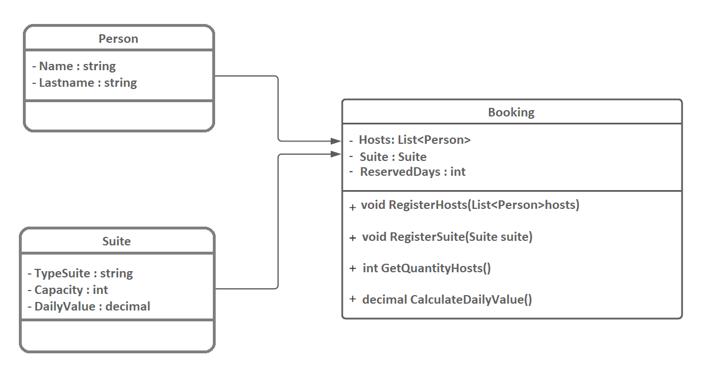

# Hotel_Hosting_System_in_C Sharp

Project developed at Digital Innovation One's Pottencial .NET Developer Bootcamp with guidance from expert [Leonardo Buta](https://github.com/leonardo-buta/ "Leonardo Buta").

Learning to build a hosting system, which will be used to make a hotel reservation.
Relating the Suite, Reservation and Person classes (which represents the guest), the program correctly calculates the values ​​of the Reservation class methods, and brings the number of guests and the daily rate, granting a 10% discount for reservations longer than 10 days.

[LICENSE](./LICENSE)
